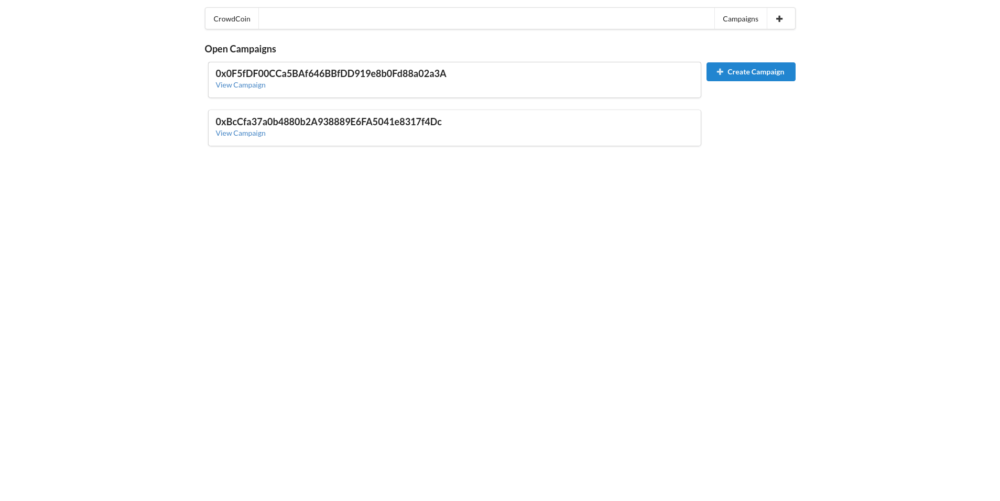
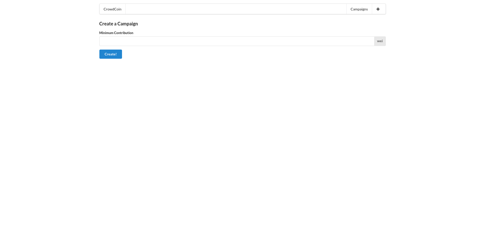
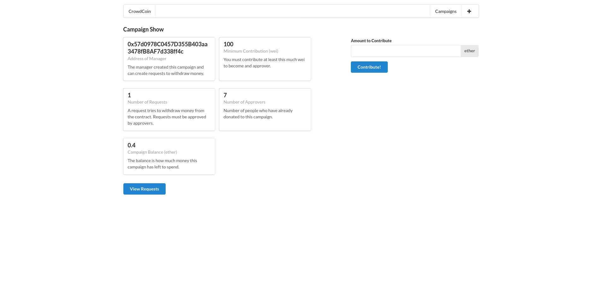
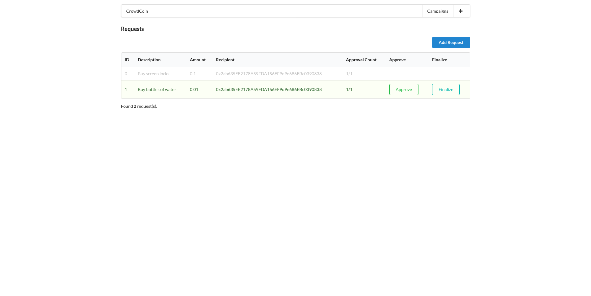
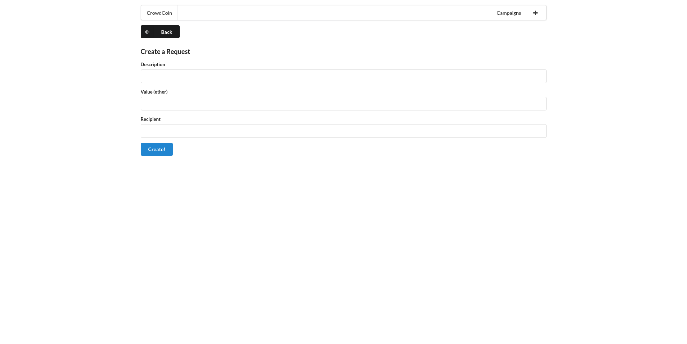

# kickstart-ethereum

Website running under the Ethereum Network inspired in the [Kickstarter](https://www.kickstarter.com/?ref=nav) crowdfunding platform.

# Commands

### Compile

Compile the Solidity Contract and generate ABI and contract's bytecode.

```bash
$ node ethereum/compile.js
```

### Deploy Contract

Deploy the Solidity Contract and obtain the contract's address.

```bash
$ node ethereum/deploy.js
```

### Test

Tests the Solidity Contract with mocha.

```bash
$ npm run test
```

### Run Development Server

Starts the development server.

```bash
$ npm run dev
```

# Steps

- Compile and deploy the contract on the Ethereum Network;
- Add a `.env` file to the project's root folder and add the following environment variables:
  - `CAMPAIGN_FACTORY_ADDR` - Campaign Factory address obtained from the deploy step.
  - `TWELVE_WORD_PASS` - Mnemonic phrase of your wallet.
  - `INFURA_URL` - Ethereum Network Infura API URL.
- Run the development server.

# Pages

## Campaigns List


## Create Campaign


## Campaign Details


## Requests List


## New Request
